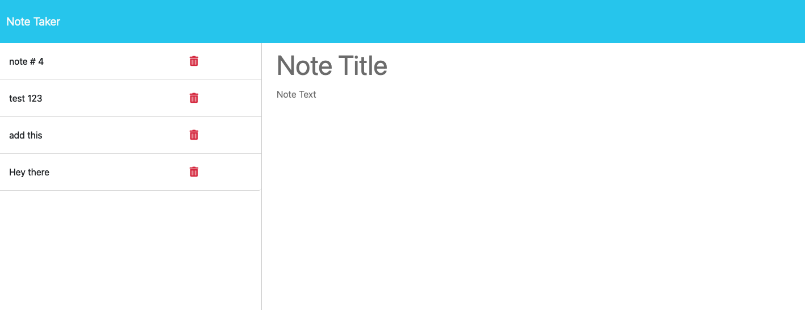

# Note-Taker

## Building a Note Taker

The purpose of this project is to create a note taker application. The note taker is designed to display previously saved notes on the left of the application and the current note in the center of the user interface. Developing this project demonstrates our ability to program with nodejs with the use of Heroku.
This project was developed with Express js. Using Express assisted in getting and posting user's input. Along Expressjs, Heroku is used for the database. 

The following is an image of the initial page of the application.
![Alt text](./public/assets/images/note_taker_splash.png
The Following image are the list of notes created that includes the notes form.

## Installation

N/A

## Usage

To view the application in action, simply click the following link: https://young-retreat-20337-4ffcc9d0add4.herokuapp.com/
The link will redirect you to the deployed version of the application. The note-taker application creates a note and can save multiple notes. 

## Credits

N/A

## License

Please refer to the LICENSE in the repo.